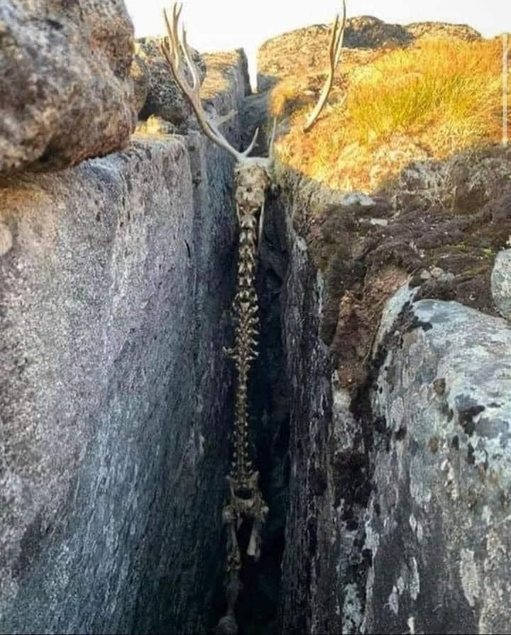

Escribir siempre ha sido algo que me ha llamado la atención, porque es la manera más accesible que tengo para representar tantas ideas que vuelan por mi mente. 

Cualquier persona que trate de escribir algo en general va a notar lo distante que está de ser algo “leíble”. Fue lo que me pasó cuando traté de escribir mis historias. La diferencia entre escribir por escribir, y escribir con el talante de un escritor es el nivel de detalle de cada pieza. Hace poco vi una publicación en facebook la cual voy a poner aquí para que la disfruten:

> “*En el oscuro confín de un bosque silente, un majestuoso alce, testigo del cruel designio del destino, yacía inmóvil entre dos rocas implacables. Sus ojos, una vez llenos de vida y nobleza, reflejaban ahora la tristeza de un adiós prematuro, mientras el viento susurraba el lamento de su última agonía. Las sombras se cerraron alrededor, ocultando su majestuosidad, y la naturaleza, impávida, siguió su curso, indiferente al corazón que dejó de latir en aquel sombrío rincón del mundo.” - Raúl Tornés*
> 

Ahora quiero que piensen en cómo lo habrían hecho ustedes. Si le pedimos a una persona común describir la imagen simplemente dirá que es el esqueleto de un desafortunado animal colgando de dos piedras. Fue lo que yo creí que más o menos hubiera dicho sin esfuerzo. 

Tampoco vamos a decir que los escritores les fluye así de fácil. Sin duda Tornés tuvo que esforzarse para encontrar las palabras adecuadas para este texto, pero lo logró.

Esto me llevó a querer desarrollar mis habilidades de descripción, mis habilidades de detallar las cosas y describirlas no solo por lo que veo sino también por lo que siento. Así que decidí hacer este escrito corto pero sustancioso mostrandoles los ejemplos que vaya realizando. Tbh, he estado practicando últimamente con una persona esto y no se imaginan cómo esta *habilidad* hace especial diferentes situaciones que no voy a mencionar porque esto es Family friendly jeje, pero los animo a practiquen esto en diferentes escenarios como yo. 

- **Pedir un café.**
    
    La cafetería parecía vacía, las únicas personas allí eramos los tres de la fila, y la cajera, que también servía el café. La persona que estaba frente a mí, decidiendo qué ordenar, parecía preocupado; un poco ansioso por los movimientos acelerados de sus dedos sin ningún motivo aparente. Una chaqueta de cuero y unos jeans oscuros completaban el sombrío semblante de este hombre. Puedo apostar que pedirá un expresso o un americano. 
    
    La cajera no está muy contenta de la indecisión de este hosco personaje. Ella mastica su chicle por inercia, porque probablemente lleva con él unas horas. Es una mujer joven que aparenta ser mayor, y lo dulce de su juventud parece ser drenado por la monotonía y el trabajo nocturno en la cafetería. 
    
    El olor del café se mezcla con el frío de la noche y algunos toques de tabaco de personas fuera de la cafetería. La luz amarilla del lugar le da un toque calido, aunque sea solo visual. No soy capaz de describir la persona atrás de mí, pero siento su presencia. Los dedos de mis pies están fríos, igual que los de mis manos. Todo esto lo pensé en cinco segundos, mirando las baldosas cuadradas blancas y rojas del piso, mientras nuestro hombre tomaba una decisión. Un latte.
    
- Las velas
    
    Una mesa de mármol. Una persona en cada esquina. Realmente no podría definir si eran hombres o mujeres. Eran entes. Seres presentes actuando sobre aquel desafortunado cuerpo. Las velas inundaban el lugar. Incontables llamas que iluminaban el habitáculo en el que se encontraban. El olor a esperma quemada era profundo, y se mezclaba con las pociones e infusiones con las que trataban aquel desafortunado cuerpo. El frío del exterior impregnaba las paredes, se escurría entre los umbrales y se convertía en una brisa unidireccional que rodeaba la habitación y enfriaba la espalda de los presentes y los no presentes. No era un lugar agradable. Sin embargo, allí se encontraban, realizando este ritual sobre aquel desafortunado cuerpo.
    
    Una herramienta forjada en hierro penetraba capas de piel desde la parte inferior del esternón hacia su pelvis dejando al descubierto sus órganos intestinales, los cuales brotaban junto a un mar de sangre el cual cubrió la superficie de la mesa. Toda esa entraña se trituró. Se recogió la mayor cantidad de sangre que se pudo drenándola a través de su arteria carótida. Con ella, pintaron símbolos en el piso. Líneas serpenteantes que no tenían sentido desde abajo, pero que desde la cúpula de aquel lugar daban forma un circulo con dos triángulos contrarios, que en su mitad describían un ojo devorador. Un ojo sin párpado en el que se puso toda la tripa, y al ser completado el ojo iluminó la habitación mucho más que las velas; expulsó un hedor indescriptible que llenó la habitación en dos segundos y del cuál emergió una figura inmensa, semihumana, con piel de fuego, con sus cavidades oculares aparentemente vacías y, en su frente, dos extensiones óseas en forma de ese. Y a pesar de todo el fuego, ese lugar jamás había sentido tanto frío.